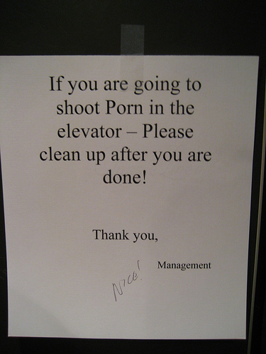
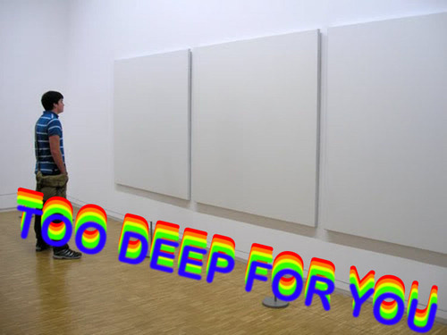
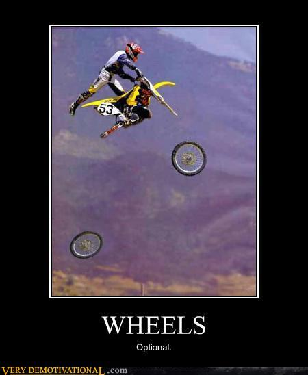

!SLIDE bullets

# `static` as in

* static code analysis
* static typing

!SLIDE bullets left-img center

# static code analysis

* dirty code
* code review
* proof-reading

!SLIDE center

# what should I refactor?

!SLIDE title-slide center

## not sexy, not obligatory

!SLIDE

# static code analysis?
## use ParseTree
